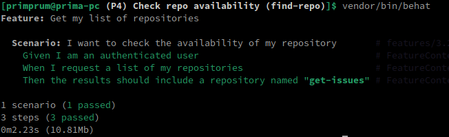
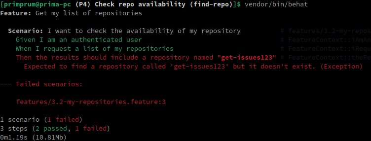

# Making an Authenticated Request to Github API

First of all, we need to be able to differentiate between Authentication and Authorization:

Authentication ---> "Who are you?" (asking about who's allowed to access)

Authorization ---> "What can you do?" (asking about the scope of the authenticated user)

<br>

### Generating tokens for Github API access

Before we could access Github API, we're gonna need to generate tokens. To do that we need to go into our Github account, then:

**Settings -> Developer Options -> Personal access tokens -> Fine-grained tokens**

<br>

### Managing authorization scope

In this test, we're gonna do the following:

**Repository access: All repositories**

**Permissions -> Repository permissions -> Administration -> Access: Read and write <br>
Permissions -> Account permissions -> Starring -> Access: Read and write <br>
Permissions -> Account permissions -> Watching -> Access: Read and write <br>**

Then, we generate the tokens.

<br>

### Using the tokens to access

Copy the tokens and paste it into `behat.yml` file in the `github_token:` part.

<br>

### Creating feature file

This is our feature file:

```gherkin
Feature: Get my list of repositories

  Scenario: I want to check the availability of my repository
    Given I am an authenticated user
    When I request a list of my repositories
    Then the results should include a repository named "get-issues"
```

That scenario is self explanatory, in which we're about to check the availability of the repository in the Github account which we're authenticated to.

In that sample, I'm about to find repo "get-issues" in my Github account.

<br>

### Generating the functions

On our project workspace:

```bash
vendor/bin/bash
```

Then we choose to generate the FeatureContext file.

<br>

After that, we get the following functions:

```php
/**
 * @Given I am an authenticated user
 */
public function iAmAnAuthenticatedUser()
{
    // stuff
}

/**
 * @When I request a list of my repositories
 */
public function iRequestAListOfMyRepositories()
{
    // stuff
}

/**
 * @Then the results should include a repository named :arg1
 */
public function theResultsShouldIncludeARepositoryNamed($arg1)
{
    // stuff
}
```

<br>

### Managing constructor to authenticate to the API

Inside FeatureContext.php we need to declare the variable as array:

```php
protected $params = [];
```

And then we assign the variable inside the constructor:

```php
public function __construct(array $parameters = [])
{
    $this->params = $parameters;
    $this->client = new \Github\Client();
}
```

<br>

### Given: I am an authenticated user

This generates function `iAmAnAuthenticatedUser()`.

In this case, we're gonna connect into Github API as an authenticated user. So, we do this:

```php
public function iAmAnAuthenticatedUser()
{
    $this->client->authenticate($this->params['github_token'], null, Github\AuthMethod::ACCESS_TOKEN);
}
```

<br>

### When: I request a list of my repositories

This generates function `iRequestAListOfMyRepositories()`.

We could then fill it with this:

```php
public function iRequestAListOfMyRepositories()
{
    $repositories = $this->client->api('current_user')->repositories();

    $this->checkResponseCode(200);

    $this->results = $repositories;
}
```

Don't forget to declare variable `$results`:

```php
protected $results = null;
```

<br>

Notice that above we have `checkResponseCode()` function, so we need to create it first:

```php
protected function checkResponseCode($expected)
{
    $statusCode   = $this->client->getLastResponse()->getStatusCode();

    if ($expected != $statusCode) {
        throw new Exception("Expected a $expected status code but got $statusCode instead!");
    }
}
```

<br>

### Then: the results should include a repository named :arg1

This generates function `theResultsShouldIncludeARepositoryNamed($arg1)`.

This will call variables from the feature file, which in this case `"get-issues"`

```gherkin
Then the results should include a repository named "get-issues"
```

<br>

And we continue to write code for the assertion:

```php
public function theResultsShouldIncludeARepositoryNamed($arg1)
{
    if (!$this->repositoryExists($this->results, $arg1)) {
        throw new Exception("Expected to find a repository called '$arg1' but it doesn't exist.");
    }
}
```

This needs to create `repositoryExists()` function:

```php
protected function repositoryExists($repoArray, $repoName)
{
    $repositories = array_column($repoArray, 'name', 'name');

    return isset($repositories[$repoName]);
}
```

<br>

### Different method of assertion

On the `repositoryExist()` function, we're using built-in PHP function `array_column()`, but we could actually use different method, such as `foreach()`.

If we want, we could write it like this in the `theResultsShouldIncludeARepositoryNamed()`:

```php
public function theResultsShouldIncludeARepositoryNamed($arg1)
{
    foreach($this->results as $repo) {
        if ($arg1 == $repo['name']) {
            return true;
        }
    }

    throw new Exception("Expected to find a repository called '$arg1' but it doesn't exist.");
}
```

That would still give the same result, and we don't need to create `repositoryExist()` function.

<br>

### Running the test

We'll get this result:



As we can see, it is successfully found the `get-issues` repo.

<br>

### Negative test

Suppose that we want to test a Github repo where it's non-existent at all.

In here, we're gonna try with `get-issues123` repo which I don't have:



<br>

### Summary of the project

This project demonstrates how to make an authenticated request to the GitHub API using PHP Behat.

It outlines the process of generating tokens, managing authorization scope, and utilizing those tokens to access the GitHub API.

Additionally, it provides a step-by-step guide for creating feature files, generating functions, and implementing constructor methods to authenticate to the API. The project includes examples of positive and negative tests to verify the functionality of accessing and manipulating repositories via the GitHub API.

<br>

### What's the purpose of this test?

The purpose of this test is to ensure that the authentication and authorization mechanisms for accessing the GitHub API are correctly implemented and functioning as expected.

By simulating authenticated requests to the API and verifying the results, the test aims to validate that users can securely interact with GitHub repositories according to their specified permissions. This test serves to enhance the reliability and security of applications that rely on GitHub API integration for repository management functionalities.

<br>

### Test demo

[](https://www.youtube.com/embed/_UZN9N0ZB5Q)
